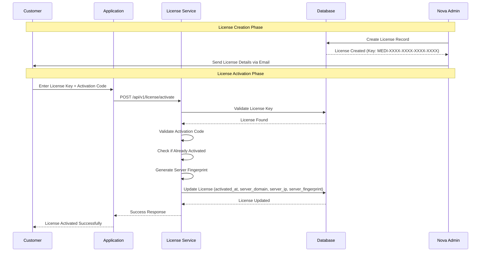
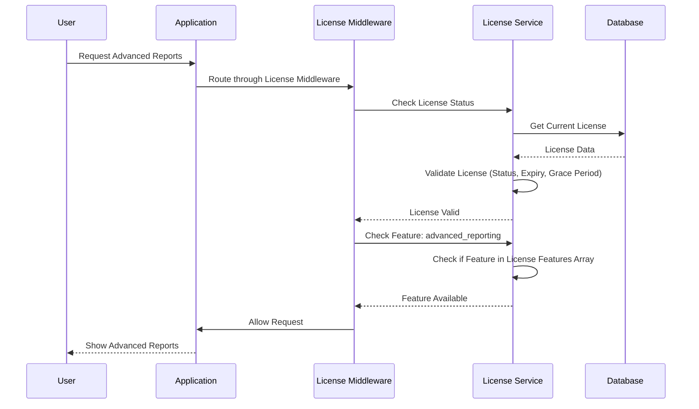
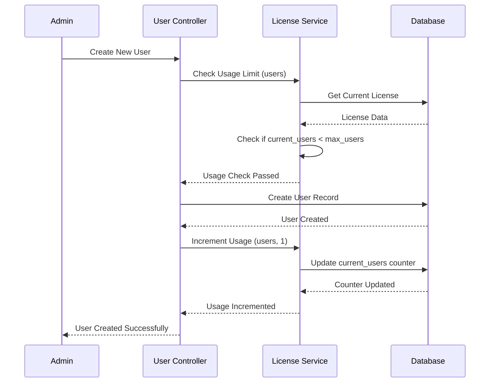
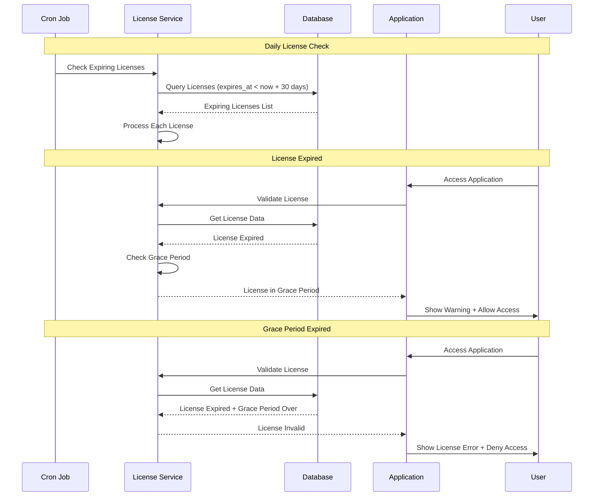
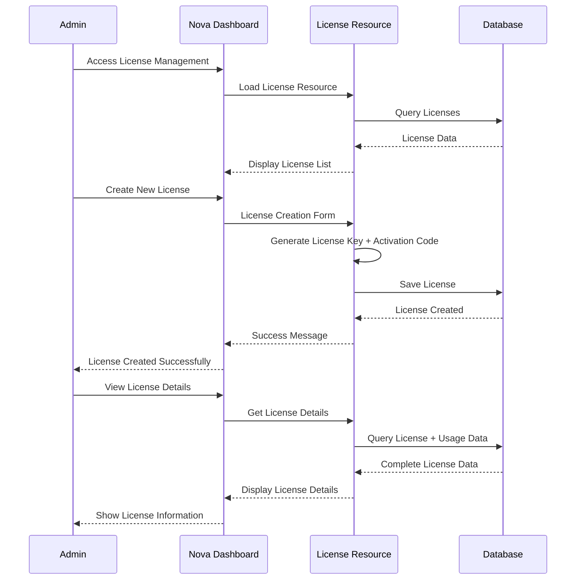
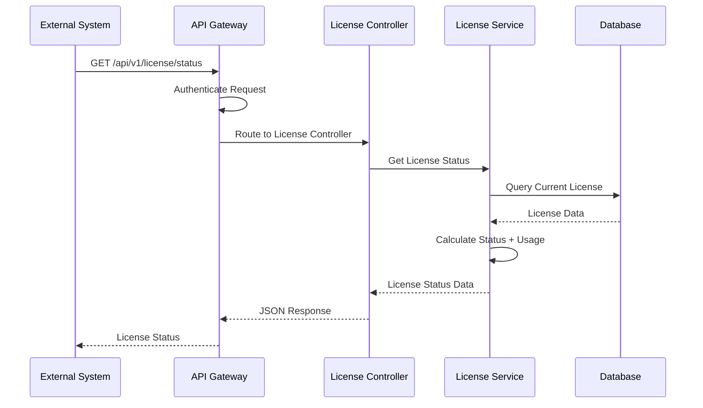
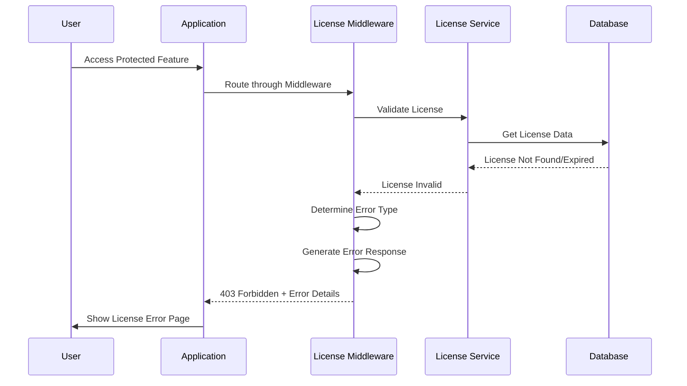

# Licensing Flow Examples and Use Cases

## 1. Complete License Activation Flow Example

### Scenario: New Customer Activates License



### API Request/Response Example

**Activation Request:**
```bash
curl -X POST http://localhost:8000/api/v1/license/activate \
  -H "Content-Type: application/json" \
  -H "Authorization: Bearer YOUR_TOKEN" \
  -d '{
    "license_key": "MEDI-VN1G-AFW8-GEQP-MIKD",
    "activation_code": "KS0NMWVN"
  }'
```

**Success Response:**
```json
{
  "success": true,
  "message": "License activated successfully",
  "data": {
    "license": {
      "id": 1,
      "license_key": "MEDI-VN1G-AFW8-GEQP-MIKD",
      "status": "active",
      "license_type": "premium",
      "customer_name": "Demo Clinic",
      "expires_at": "2026-01-06",
      "activated_at": "2025-01-06T10:30:00Z",
      "server_domain": "demo.medinext.com",
      "server_ip": "192.168.1.100"
    }
  }
}
```

## 2. License Validation Flow Example

### Scenario: User Accesses Protected Feature



### Middleware Implementation Example

```php
// routes/web.php
Route::middleware(['license:advanced_reporting'])->group(function () {
    Route::get('/reports/advanced', [ReportController::class, 'advanced']);
    Route::get('/reports/analytics', [ReportController::class, 'analytics']);
});

// app/Http/Middleware/LicenseValidation.php
public function handle(Request $request, Closure $next, string $feature = null): Response
{
    // Skip validation for certain routes
    if ($this->shouldSkipValidation($request)) {
        return $next($request);
    }

    // Check if application should be restricted
    if ($this->licenseService->shouldRestrictApplication()) {
        return $this->handleLicenseRestriction($request);
    }

    // Check specific feature if provided
    if ($feature && !$this->licenseService->hasFeature($feature)) {
        return $this->handleFeatureRestriction($request, $feature);
    }

    return $next($request);
}
```

## 3. Usage Tracking Flow Example

### Scenario: Creating New User



### Controller Implementation Example

```php
// app/Http/Controllers/UserController.php
public function store(Request $request)
{
    $licenseService = app(LicenseService::class);
    
    // Check usage limits before creating user
    $usage = $licenseService->checkUsageLimit('users');
    if (!$usage['allowed']) {
        return response()->json([
            'error' => 'User limit exceeded',
            'message' => $usage['message'],
            'current' => $usage['current'],
            'limit' => $usage['limit']
        ], 403);
    }
    
    // Validate request
    $validated = $request->validate([
        'name' => 'required|string|max:255',
        'email' => 'required|email|unique:users',
        'password' => 'required|min:8'
    ]);
    
    // Create user
    $user = User::create($validated);
    
    // Increment usage counter
    $licenseService->incrementUsage('users', 1);
    
    return response()->json([
        'message' => 'User created successfully',
        'user' => $user,
        'usage' => [
            'current' => $usage['current'] + 1,
            'limit' => $usage['limit'],
            'percentage' => (($usage['current'] + 1) / $usage['limit']) * 100
        ]
    ], 201);
}
```

## 4. License Expiration Flow Example

### Scenario: License Expires



### Expiration Handling Example

```php
// app/Services/LicenseService.php
public function isValid(): bool
{
    if ($this->status !== 'active') {
        return false;
    }

    $now = now();
    $expirationDate = $this->expires_at;
    $gracePeriodEnd = $expirationDate->addDays($this->grace_period_days);

    return $now->lte($gracePeriodEnd);
}

public function isInGracePeriod(): bool
{
    if ($this->status !== 'active') {
        return false;
    }

    $now = now();
    $expirationDate = $this->expires_at;
    $gracePeriodEnd = $expirationDate->addDays($this->grace_period_days);

    return $now->gt($expirationDate) && $now->lte($gracePeriodEnd);
}
```

## 5. Nova Dashboard Flow Example

### Scenario: Admin Manages Licenses



### Nova Resource Example

```php
// app/Nova/License.php
public function fields(NovaRequest $request): array
{
    return [
        // License Information
        Text::make('License Key')->copyable(),
        Select::make('License Type')->options([
            'standard' => 'Standard',
            'premium' => 'Premium',
            'enterprise' => 'Enterprise',
        ]),
        Badge::make('Status')->map([
            'active' => 'success',
            'expired' => 'danger',
            'suspended' => 'warning',
        ]),
        
        // Usage Tracking
        Progress::make('Users Usage', function () {
            return $this->getUsagePercentage('users');
        })->onlyOnDetail(),
        
        // Customer Information
        Text::make('Customer Name'),
        Text::make('Customer Email'),
        
        // Validity Period
        Date::make('Expires At'),
        Number::make('Grace Period Days'),
    ];
}
```

## 6. API Integration Flow Example

### Scenario: External System Checks License



### API Response Example

```json
{
  "success": true,
  "data": {
    "has_license": true,
    "status": "active",
    "message": "License is active",
    "license": {
      "id": 1,
      "license_type": "premium",
      "customer_name": "Demo Clinic",
      "expires_at": "2026-01-06",
      "days_until_expiration": 365,
      "is_in_grace_period": false,
      "days_in_grace_period": 0
    },
    "usage": {
      "users": {
        "current": 15,
        "limit": 50,
        "percentage": 30
      },
      "clinics": {
        "current": 2,
        "limit": 5,
        "percentage": 40
      },
      "patients": {
        "current": 1250,
        "limit": 10000,
        "percentage": 12.5
      },
      "appointments": {
        "current": 450,
        "limit": 5000,
        "percentage": 9
      }
    }
  }
}
```

## 7. Error Handling Flow Example

### Scenario: License Validation Fails



### Error Response Examples

**License Not Found:**
```json
{
  "error": "License validation failed",
  "message": "No valid license found. Please contact support.",
  "error_code": "LICENSE_VALIDATION_FAILED"
}
```

**License Expired:**
```json
{
  "error": "License validation failed",
  "message": "Your license has expired. Please renew your license to continue using the application.",
  "error_code": "LICENSE_VALIDATION_FAILED",
  "expires_at": "2025-01-01",
  "grace_period_end": "2025-01-08"
}
```

**Feature Not Available:**
```json
{
  "error": "Feature not available",
  "message": "The feature 'advanced_reporting' is not available in your current license.",
  "error_code": "FEATURE_NOT_AVAILABLE",
  "feature": "advanced_reporting"
}
```

**Usage Limit Exceeded:**
```json
{
  "error": "Usage limit exceeded",
  "message": "Usage limit exceeded for users",
  "error_code": "USAGE_LIMIT_EXCEEDED",
  "current": 50,
  "limit": 50
}
```

## 8. Frontend Integration Examples

### React Component Example

```jsx
// components/LicenseStatus.jsx
import React, { useState, useEffect } from 'react';

const LicenseStatus = () => {
  const [licenseStatus, setLicenseStatus] = useState(null);
  const [loading, setLoading] = useState(true);

  useEffect(() => {
    fetchLicenseStatus();
  }, []);

  const fetchLicenseStatus = async () => {
    try {
      const response = await fetch('/api/v1/license/status');
      const data = await response.json();
      setLicenseStatus(data.data);
    } catch (error) {
      console.error('Failed to fetch license status:', error);
    } finally {
      setLoading(false);
    }
  };

  if (loading) return <div>Loading license status...</div>;

  if (!licenseStatus.has_license) {
    return (
      <div className="alert alert-danger">
        <h4>No License Found</h4>
        <p>Please contact support to activate your license.</p>
      </div>
    );
  }

  if (licenseStatus.status === 'expired') {
    return (
      <div className="alert alert-warning">
        <h4>License Expired</h4>
        <p>Your license expired on {licenseStatus.license.expires_at}.</p>
        <p>Please renew your license to continue using the application.</p>
      </div>
    );
  }

  return (
    <div className="license-status">
      <h4>License Status: <span className="badge badge-success">Active</span></h4>
      <p>Type: {licenseStatus.license.license_type}</p>
      <p>Expires: {licenseStatus.license.expires_at}</p>
      <p>Days remaining: {licenseStatus.license.days_until_expiration}</p>
    </div>
  );
};

export default LicenseStatus;
```

### Vue.js Component Example

```vue
<!-- components/LicenseUsage.vue -->
<template>
  <div class="license-usage">
    <h4>License Usage</h4>
    <div v-for="(usage, type) in usageData" :key="type" class="usage-item">
      <div class="usage-label">{{ type }}</div>
      <div class="progress">
        <div 
          class="progress-bar" 
          :class="getProgressBarClass(usage.percentage)"
          :style="{ width: usage.percentage + '%' }"
        >
          {{ usage.current }} / {{ usage.limit }}
        </div>
      </div>
      <div class="usage-percentage">{{ usage.percentage.toFixed(1) }}%</div>
    </div>
  </div>
</template>

<script>
export default {
  data() {
    return {
      usageData: {}
    };
  },
  async mounted() {
    await this.fetchUsageData();
  },
  methods: {
    async fetchUsageData() {
      try {
        const response = await fetch('/api/v1/license/usage');
        const data = await response.json();
        this.usageData = data.data;
      } catch (error) {
        console.error('Failed to fetch usage data:', error);
      }
    },
    getProgressBarClass(percentage) {
      if (percentage >= 90) return 'bg-danger';
      if (percentage >= 75) return 'bg-warning';
      return 'bg-success';
    }
  }
};
</script>
```

## 9. Automated Testing Examples

### PHPUnit Test Example

```php
// tests/Feature/LicenseTest.php
class LicenseTest extends TestCase
{
    use RefreshDatabase;

    public function test_license_activation_success()
    {
        $license = License::factory()->create([
            'status' => 'active',
            'activated_at' => null
        ]);

        $response = $this->postJson('/api/v1/license/activate', [
            'license_key' => $license->license_key,
            'activation_code' => $license->activation_code
        ]);

        $response->assertStatus(200)
                ->assertJson([
                    'success' => true,
                    'message' => 'License activated successfully'
                ]);

        $this->assertDatabaseHas('licenses', [
            'id' => $license->id,
            'activated_at' => now()
        ]);
    }

    public function test_license_validation_fails_when_expired()
    {
        $license = License::factory()->create([
            'status' => 'active',
            'expires_at' => now()->subDays(10),
            'grace_period_days' => 7
        ]);

        $licenseService = app(LicenseService::class);
        $result = $licenseService->validateLicense($license->license_key);

        $this->assertFalse($result['valid']);
        $this->assertEquals('LICENSE_EXPIRED', $result['error_code']);
    }

    public function test_usage_limit_exceeded()
    {
        $license = License::factory()->create([
            'max_users' => 5,
            'current_users' => 5
        ]);

        $licenseService = app(LicenseService::class);
        $result = $licenseService->checkUsageLimit('users');

        $this->assertFalse($result['allowed']);
        $this->assertEquals('USAGE_LIMIT_EXCEEDED', $result['error_code']);
    }
}
```

## 10. Monitoring and Alerting Examples

### License Expiration Alert

```php
// app/Console/Commands/CheckExpiringLicenses.php
class CheckExpiringLicenses extends Command
{
    protected $signature = 'license:check-expiring {--days=30}';
    protected $description = 'Check for licenses expiring soon';

    public function handle()
    {
        $days = $this->option('days');
        $expiringLicenses = License::active()
            ->whereBetween('expires_at', [now(), now()->addDays($days)])
            ->get();

        foreach ($expiringLicenses as $license) {
            $this->sendExpirationAlert($license);
        }

        $this->info("Found {$expiringLicenses->count()} licenses expiring within {$days} days");
    }

    private function sendExpirationAlert(License $license)
    {
        // Send email notification
        Mail::to($license->customer_email)->send(new LicenseExpirationAlert($license));
        
        // Log the alert
        Log::warning('License expiring soon', [
            'license_id' => $license->id,
            'customer' => $license->customer_name,
            'expires_at' => $license->expires_at,
            'days_remaining' => now()->diffInDays($license->expires_at)
        ]);
    }
}
```

### Usage Monitoring

```php
// app/Console/Commands/MonitorUsage.php
class MonitorUsage extends Command
{
    protected $signature = 'license:monitor-usage';
    protected $description = 'Monitor license usage and send alerts';

    public function handle()
    {
        $licenses = License::active()->get();

        foreach ($licenses as $license) {
            $this->checkUsageThresholds($license);
        }
    }

    private function checkUsageThresholds(License $license)
    {
        $thresholds = [
            'users' => 90,
            'clinics' => 90,
            'patients' => 95,
            'appointments' => 90
        ];

        foreach ($thresholds as $type => $threshold) {
            $percentage = $license->getUsagePercentage($type);
            
            if ($percentage >= $threshold) {
                $this->sendUsageAlert($license, $type, $percentage);
            }
        }
    }

    private function sendUsageAlert(License $license, string $type, float $percentage)
    {
        Log::warning('License usage threshold exceeded', [
            'license_id' => $license->id,
            'type' => $type,
            'percentage' => $percentage,
            'current' => $license->{"current_{$type}"},
            'limit' => $license->{"max_{$type}"}
        ]);
    }
}
```

These examples demonstrate the complete licensing flow implementation with practical code examples, API interactions, and monitoring capabilities. The system provides a robust foundation for managing software licenses with proper validation, usage tracking, and administrative controls.
